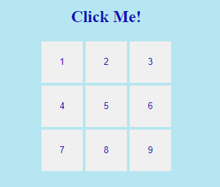
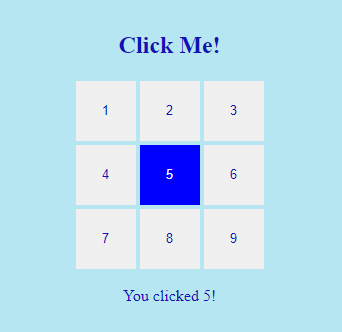
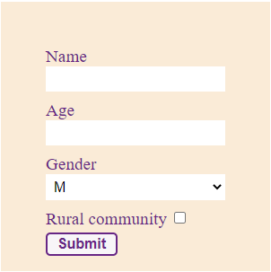
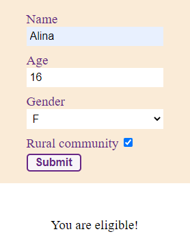
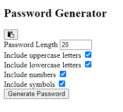
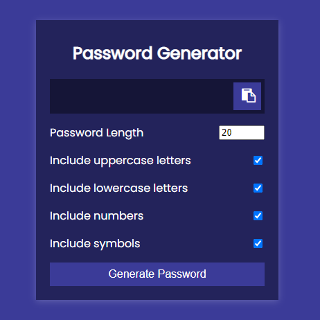

# Workshop - Password Generator

- Step 1: Use codesandbox for setup web project
Login into https://codesandbox.io/ and select new project from template, choose Vanilla JavaScript.
You can use [VS Code](https://code.visualstudio.com/) also.

- Step 2: Three Components of a Web Page
    - Content - HTML
    - Presentation - CSS
    - Behaviour - JavaScript

- Step 3: Update the html file to create a mock like the below image.




```html
  <h2>Click Me!</h2>
    <div class="container">
        <div class="btn-container"> 
            <button class="item">1</button>
            <button class="item">2</button>
            <button class="item">3</button>
        </div>
        <div class="btn-container"> 
            <button class="item">4</button>
            <button class="item">5</button>
            <button class="item">6</button>
        </div>
        <div class="btn-container"> 
            <button class="item">7</button>
            <button class="item">8</button>
            <button class="item">9</button>
        </div>
    </div>
    <p id="para"></p>
```

- Step 4: Link your css file to your html file by giving the below code in your head element.

```html
<link rel="stylesheet" href="./styles.css">
```
- Step 5: Try to center align the body.
```css
body{
    display: flex;
    justify-content: center;
    align-items: center;
    flex-direction: column;
    height: 100vh;
}
```
- Step 6: Try to give background color and font color to the body.
```css
body{
    background-color: rgb(173, 229, 243);
    color:#b6e6f1;
}
```
- Step 7: Understanding the hexadecimal color codes.

A hexadecimal color is specified with: #RRGGBB.

RR (red), GG (green) and BB (blue) are hexadecimal integers between 00 and FF specifying the intensity of the color.

For example, #0000FF is displayed as blue, because the blue component is set to its highest value (FF) and the others are set to 00.

- Step 8: Try to give display of flex to each button container.
```css
.btn-container{
    display: flex;
    flex-direction: row;
}
```

- Step 9: Try to give width, height of 60px and margin of 2px to button elements using css selector.
```css
button{
    width: 60px;        
    height: 60px;
    margin: 2px;
}
```

- Step 10: Try to give font color to #1212b6 and remove the border using css.
```css
button{
   color: #1212b6; 
   border: none;
}
```

- Step 11: Adding behaviour to the webpage

Select all the button elements and p element using javascript
```js
const buttons = document.querySelectorAll("button");
const para = document.getElementById("para");
```

- Step 12: Understand var, let and const
    - var : function scope
    - let and const : block scope

```javascript
function foo() {
    var a = 5;
    var b = 10;
    var c = a + b;
}
foo();
console.log(c);
```

```javascript
function foo() {
    var a = 5;
    var b = 10;
    const c = a + b;
    if (b > a) {
        let c = a + b;
    }
    console.log(c);
    return c;
}
const sum = foo();
console.log(sum);
```

- Step 13: Creating a color class and giving background color to blue, font color to white and cursor to pointer using css selector.
```css
.color{
    background-color: blue;
    color: white;
    cursor: pointer;
} 
```

- Step 14: Try adding the color class on clicking the button using js.
```js
for(btn in buttons){
    buttons[btn].onclick = function(){
        buttons.forEach(
            (function(item){
            item.classList.remove('color');
        } ))
        this.classList.add('color'); 
    }   
}
```
- Step 15: Understanding forEach and for in methods.

The forEach() method calls a function for each element in an array.
```js
const numbers = [65, 44, 12, 4];
numbers.forEach(myFunction)
function myFunction(num) {
  console.log(num)
}
```

The for..in loop in JavaScript allows us to iterate over all property keys of an object.
```js
const student = {
    name: 'Monica',
    class: 7,
    age: 12
}

// using for...in
for ( let key in student ) {

    // display the properties
    console.log(key);
}
```

- Step 16: Try adding the content in p element using js.

Add the below code to your onclick function.
```js
para.innerHTML = `You clicked ${this.innerHTML}!`;
```

- Step 17: Check your output.



- Step 18: Calling a function when a button is clicked and getting content inside an element:
```html
<button onclick="myFunction()">Click me</button>

<p id="demo"></p>
```
```js
function myFunction() {
  document.getElementById("demo").innerHTML = "Hello World";
}
```
- Step 19: Remove method from html and bind the click event in javascript
```html
<button id="submitBtn">Click me</button>

<p id="demo"></p>
```
```js
const submitBtn = document.getElementById("submitBtn");
submitBtn.addEventListener('click', myFunction);

function myFunction() {
  document.getElementById("demo").innerHTML = "Hello World";
}
```

- Step 20: Understanding functions in javascript

    In JavaScript, we can divide up our code into reusable parts called functions.
    - Function Decalration
       ```javascript
       function add(a, b) {
           return a + b;
       }
       ```
    Question: Write a function for adding three numbers
    - Function Expression
      ```javascript
      const add = function(a,b) {
          return a + b;
      }
      ```
    Question: Write a function for adding three numbers
    - Arrow function
      ```javascript
      const add = (a,b) => a + b;
      ```
    - Calling a function
      ```javascript
      const c = add(4,5);
      console.log(c);
      ```
    - Return Statement

      The return statement stops the execution of a function and returns a value.
      ```js
      function isAdult(age){
        if(age>18){
            return true;
        }
        return false;
      }

      isAdult(21); //calling the function
      >> true
      ```
    - Anonymous Functions

      An anonymous function is a function without a name.
      ```js
      const print = function() {
      console.log('Anonymous function');
      };

      print();
      ```
      Because we need to call the anonymous function later, we assign the anonymous function to the <mark style="background-color:lightblue">print</mark> variable.

- Step 21: Function as a first class citizen and Higher Order Function

*When a function can be passed as a normal argument just like number or string, this feature is called Function as first class citizen*

Example: In setTimeout, a function is passed for later use. The passed function is called callback function, and the function which can accept another function as an argument is called Higher Order Function.

**Def: Any function which takes function as an argument or return function is called Higher Order Function**

```js
const submitBtn = document.getElementById("submitBtn");
submitBtn.addEventListener('click', myFunction);

function myFunction() {
  document.getElementById("demo").innerHTML = "Hello World";
}
```

- addEventListener is also a Higher Order Function,
- myFunction passed in the addEventListner is a callback function.

- Step 22: **Getting values of various form inputs(text, checkbox, select) through js.**

   Try creating a simple form like the below image:

   

   ```html
    <form id="form">
        <label for="name">Name</label>
        <input type="text" id="name" name="name" required>
        <label for="age">Age</label>
        <input type="number" id="age" name="age" min="1 max="100" required>
        <label for="gender">Gender</label>
        <select name="gender" id="gender" required>
            <option value="male">M</option>
            <option value="female">F</option>
        </select>
        <div>
            <label for="rural">Rural community</label>
            <input type="checkbox" id="rural">
        </div>
        <button type="submit" id="submit">Submit</button>      
    </form>  
     <p id="para"></p>
   ```
   ```css
   body{
    display: flex;
    justify-content: center;
    align-items: center;
    flex-direction: column;
    height: 100vh;
    }
    
    form{
        background-color: antiquewhite;
        display: flex;
        flex-direction: column;
        width: 200px;
        height: 200px;
        padding: 50px;
    }
    
    input,select{
        margin-bottom: 10px;
        border: none;
        padding: 5px;
        font-size: medium;
    }
    
    label{
        font-size: larger;
        color: rgb(103, 38, 133);;
    }
    
    input[type="checkbox"]
    {
        vertical-align:middle;
    }
    button{
        border-radius: 5px;
        border: 2px solid rgb(103, 38, 133);
        width: 80px;
        font-size: medium;
        padding: 2px;
        font-weight: bold;
        color:rgb(103, 38, 133); 
        background-color: rgb(248, 245, 248);
    }
    
    p{
        margin-top: 50px;
        font-size: larger;
    }

   ```
- Step 23: Try getting the values of form input fields on submit.

```js
const form = document.getElementById("form");
const para = document.getElementById("para");
const ageEl = document.getElementById("age");
const genderEl = document.getElementById("gender");
const ruralEl = document.getElementById("rural");

form.addEventListener('submit', isEligible);

function isEligible(event) {
    event.preventDefault()
    const age = ageEl.value;
    const gender = genderEl.value;
    const checked = ruralEl.checked;  
    console.log(age,gender,checked);
}
```
Check your console.

- Step 24: Try creating a function to check the eligibility criteria for marriage in India (If rural community is checked, age can be 2 years less).

```js
function isEligible(event) {
    event.preventDefault()
    const age = this.elements.age.value;
    const gender = this.elements.gender.value;
    const checked = this.elements.rural.checked; 

    let value =""; 

    if(age>=18 && gender == "female"){
        value = "You are eligible!";
    }else if(age>=21 && gender == "male"){
        value = "You are eligible!"
    }else if(checked && (age>=16 && gender == "female")){
        value = "You are eligible!"
    }else if(checked && (age>=19 && gender == "male")){
        value = "You are eligible!"
    }else{
        value = "Not Eligible!"
    }   

    para.innerHTML = value;
}
```


- Step 25: Generating Random Numbers in javascript

   - Math.random() returns a random number between 0 (inclusive) and 1 (exclusive)
   ```js
   const x = Math.random();
   console.log(x);
   ```
   - Return a random number between 0 and 10
   ```js
   const x = Math.random() * 10;
   console.log(x);
   ```
   - Return a random whole number between 1 and 10
   ```js
   const x = Math.floor((Math.random() * 10) + 1);
   console.log(x);
   ```
   Math.floor(x)      //Returns x rounded down to its nearest integer

- Step 26: Understanding ASCII code and some methods

  - **ASCII** is a numeric value that is given to different characters and symbols for computers to store and manipulate. 

  - Getting ASCII code for characters

      The *charCodeAt()* method returns the ASCII code of the character at a specified index (position) in a string.

    The index of the first character is 0, the second is 1, ...
    ```js
    "HELLO WORLD".charCodeAt(0);
     >> 72    // returns ASCII code for H
    ```

  - Every number can also be converted into char

    ```js
    String.fromCharCode(65);
     >> 'A'
    ```

- Step 27: Try creating four different functions 

    - Function to generate random lowercase letters

      ```js
      function getRandomLower(){
          return String.fromCharCode(Math.floor(Math.random() * 26) + 97)
      }
      ```
    - Function to generate random uppercase letters

      ```js
      function getRandomUpper(){
          return // random uppercase letters
      }
      ```
    - Function to generate random whole numbers

      ```js
      function getRandomNumber(){
          return // random numbers
      }
      ```
    - Function to generate random symbols

      ```js
      function getRandomSymbol(){
         const symbols = '!@#$%^&*(){}[]+<>/,.'
         return // random symbols
      }
      ```
    
- Step 28: Create a new folder named Password Generator. Inside that folder, create three files - 

   - html file
   - css file (link your css file to your html page)
   - js file (link your script file to your html page)


Update the html file to create a mock like the below image.



```html
<div class="container">
        <h2>Password Generator</h2>
        <div class="result-container">
            <span id="result"></span>
                <button class="btn" id="clipboard">
                    <i class="fa fa-clipboard"></i>
                </button>
        </div>
        <div class="settings">
            <div class="setting">
                <label>Password Length</label>
                <input type="number" id="length" min="4" max="20" value="20">
            </div>
            <div class="setting">
                <label>Include uppercase letters</label>
                <input type="checkbox" id="uppercase" checked>
            </div>
            <div class="setting">
                <label>Include lowercase letters</label>
                <input type="checkbox" id="lowercase" checked>
            </div>
            <div class="setting">
                <label>Include numbers</label>
                <input type="checkbox" id="numbers" checked>
            </div>
            <div class="setting">
                <label>Include symbols</label>
                <input type="checkbox" id="symbols" checked>
            </div>
        </div>
        <button class="btn btn-large" id="generate">
            Generate Password
        </button>
    </div>
```

- Step 29: Trying adding some styles to the body and h2 element so that it will be center aligned.

```css
@import url('https://fonts.googleapis.com/css2?family=Poppins:wght@200;400&display=swap');

*{
    box-sizing: border-box;
}

body{
    background-color: #3b3b98;
    color: #fff;
    display: flex;
    flex-direction: column;
    align-items: center;
    justify-content: center;
    height: 100vh;
    margin: 0;
    font-family: 'Poppins', sans-serif;
    overflow: hidden;
}
h2{
    margin: 10px 0 20px;
    text-align: center;
}
```

- Step 30: Try giving box-shadow, padding of 20px, width of 350px and max-width of 100% to your main container.

```css
.container{
    background-color: #23235b;
    box-shadow: 0 2px 10px rgba(255, 255, 255, 0.2);
    padding: 20px;
    width: 350px;
    max-width: 100%;
}
```

- Step 31: Try adding some styles to your result container, buttons and input elements so that your output will look like the below image.



```css
.result-container{
    background-color: rgba(0, 0, 0, 0.4);
    display: flex;
    justify-content: flex-start;
    align-items: center;
    position: relative;
    font-size: 18px;
    letter-spacing: 1px;
    padding: 12px 10px;
    height: 50px;
    width: 100%;
}


.result-container #result{
    word-wrap: break-word;
    max-width: calc(100% - 40px);
}

.result-container .btn{
    position: absolute;
    top: 5px;
    right: 5px;
    width: 40px;
    height: 40px;
    font-size: 20px;
}

.btn{
    border: none;
    background-color: #3b3b98;
    color: white;
    font-size: 16px;
    padding: 8px 12px;
    cursor: pointer;
}

.btn-large{
    display: block;
    width: 100%;
}

.setting{
    display: flex;
    justify-content: space-between;
    align-items: center;
    margin: 15px 0;
}
```

- Step 32: Try getting the result, generate and clipboard element in js (using getElementById).

```js
const resultEl = document.getElementById('result')
const generateEl = document.getElementById('generate')
const clipboardEl = document.getElementById('clipboard')
```

- Step 33: Copy and paste the four random functions that we have created in the js file. ( getRandomLower(), getRandomUpper(), getRandomNumber(), getRandomSymbol() )

- Step 34: Try adding addEventListener method on click of generate password button.

In the addEventListener method, give generatePasswordHandler as a callback function.

- Step 35: Creat generatePasswordHandler function. In the function, try to get the length, uppercase, lowercase, numbers and symbol elements in js (using getElementById). Then try to get the values of each input field.

```js
const generatePasswordHandler = () => {
    const lengthEl = document.getElementById('length')
    //...
    const length = +lengthEl.value
    //...

    resultEl.innerText = generatePassword(hasLower,hasUpper, hasNumber,hasSymbol,length)
}
```

- Step 36: Create function generatePassword.

 In the function create one variable generatedPassword and give it a value of an empty string.

Using conditional statement, try checking the values of each checkbox and if the value is true then add the string to the generatedPassword variable. At last return the string generatedPassword.

```js
function generatePassword(lower, upper, number, symbol, length){
    let generatedPassword = '';
    console.log(lower,upper,number,symbol)

    if (lower || upper || number || symbol){

        while(generatedPassword.length < length) {
            if(lower) generatedPassword += getRandomLower();
            if(upper) //...
            if(number) //...
            if(symbol) //...
        }
    }
    
    return generatedPassword;
}
```

- Step 37: Try adding addEventListener method on click of clipboard element and pass copyToClipboard as a callback function.

- Step 38: Try Creating copyToClipboard function:

Copy a text in clipboard using javascript.
```js
const copyToClipboard = () => {
  // Get the text to be copied in a textarea
  // Use document.getElementById() method to capture the value
  //...
  
  // Check if the password is empty or not, if it is empty do not return anything
    const password = resultEl.innerText
    if(!password){return}

  //Append the textarea element to the body 
     document.body.appendChild(textarea)

  // Select the text field using element.select() method
  //...
  // Copy the text using the document.execCommand(“copy”)
  //...
  // Remove the text using element.remove() method.
  //...
    alert("Password copied to clipboard!");
}
```

**Congratulations, you have successfully completed the Password Generator Project!**


